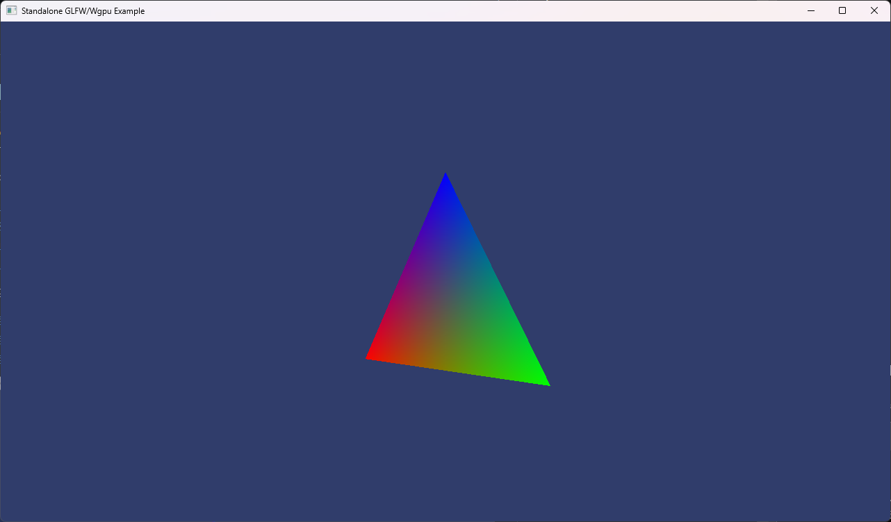

# Go / GLFW / Wgpu Triangle

A cross-platform [Go](https://go.dev/) graphics demo using [wgpu](https://wgpu.rs/) (via the [`cogentcore/webgpu`](https://github.com/cogentcore/webgpu) bindings over `wgpu-native`) to render a spinning triangle. Supports native desktop and WebGPU ([WASM](https://webassembly.org/)).

> **Related Projects:**
> - [wgpu-example](https://github.com/matthewjberger/wgpu-example) - Rust original (winit + egui + Android + OpenXR + Steam Deck)
> - [Nightshade](https://github.com/matthewjberger/nightshade) - Game engine based on the Rust boilerplate
> - [vulkan-example](https://github.com/matthewjberger/vulkan-example) - Vulkan version
> - [opengl-example](https://github.com/matthewjberger/opengl-example) - OpenGL version

Other languages (experimental):
- [wgpu-example-odin](https://github.com/matthewjberger/wgpu-example-odin)
- [wgpu-example-c](https://github.com/matthewjberger/wgpu-example-c)
- [wgpu-example-zig](https://github.com/matthewjberger/wgpu-example-zig)



## Quickstart

All platforms are driven through the [`justfile`](./justfile). Run `just` (no args) to list every recipe.

| Platform       | Run             | Build only        |
|----------------|-----------------|-------------------|
| Native Desktop | `just run`      | `just build`      |
| WebGPU (WASM)  | `just run-wasm` | `just build-wasm` |

## Platform Setup

### Native Desktop

**Prerequisites:**
- [Go](https://go.dev/dl/) 1.22+
- A C toolchain on `PATH` (cgo is required by `cogentcore/webgpu`). On Windows, [MinGW-w64](https://www.mingw-w64.org/) via [scoop](https://scoop.sh) (`scoop install gcc`) or [MSYS2](https://www.msys2.org/) works.
- A GPU supporting Vulkan, D3D12, or Metal

```bash
just run    # Builds and runs the desktop binary
just build  # Build only
```

Press `Escape` or close the window to quit.

**Optional env vars:**
- `WGPU_LOG_LEVEL` - one of `OFF`, `ERROR`, `WARN`, `INFO`, `DEBUG`, `TRACE`
- `WGPU_FORCE_FALLBACK_ADAPTER=1` - request a software adapter

### Web (WebAssembly)

**Prerequisites:** [Go](https://go.dev/dl/) 1.22+ and a browser with WebGPU support.

**Browser Support:** All Chromium-based browsers (Chrome, Edge, Brave, Vivaldi) support WebGPU. Firefox supports WebGPU starting with version 141 ([announcement](https://mozillagfx.wordpress.com/2025/07/15/shipping-webgpu-on-windows-in-firefox-141/)). Safari supports WebGPU starting with version 26.

**Build and serve:**

```bash
just run-wasm    # Builds site/main.wasm and serves site/ on http://localhost:8080
just build-wasm  # Build only (outputs site/main.wasm)
just serve       # Serve site/ without rebuilding
```

`site/index.html` and `site/wasm_exec.js` are committed, so the `site/` folder is a self-contained static site after `just build-wasm` - ready to host as-is on GitHub Pages or any static file server.

A GitHub Pages workflow at `.github/workflows/pages.yml` builds `site/main.wasm` + refreshes `site/wasm_exec.js` and pushes the result to the `gh-pages` branch on every push to `main`. To enable hosting, set **Settings → Pages → Source** to `Deploy from a branch` and pick the `gh-pages` branch (root).

## Development

```bash
just check       # go vet + gofmt -l (fails if anything is unformatted)
just format      # gofmt -w .
just test        # go test ./...
just ci          # check + test (run before pushing)
just tidy        # go mod tidy
just tidy-check  # go mod tidy -diff (shows what tidy would change)
just outdated    # go list -m -u all (deps with available updates)
just doc         # go doc -all ./render
just audit       # check + tidy-check + outdated + test (full read-only audit)
```

## Layout

```
wgpu-example-go/
├── cmd/
│   ├── wgpu-example-go/      # main binary
│   │   ├── main.go           # //go:build !js  - GLFW window + main loop
│   │   └── main_js.go        # //go:build js   - canvas + requestAnimationFrame loop
│   └── serve/                # static file server for the wasm bundle
│       └── main.go
├── render/                   # package render - reusable renderer library
│   ├── engine.go             # public Engine type, lifecycle, RenderFrame
│   ├── errors.go             # ErrSurfaceLost + isSurfaceLost helper
│   ├── gpu.go                # surface, adapter, device, queue, depth texture
│   ├── pipeline.go           # createPipeline + //go:embed shader.wgsl
│   ├── projection.go         # perspectiveZO wrapper (mgl32.Perspective + depth remap)
│   ├── scene.go              # vertex/index buffers, scene, mvp build
│   ├── shader.wgsl
│   ├── uniform.go            # uniformBuffer/binding types + constructors
│   ├── uniform_js.go         # //go:build js     - per-frame CreateBufferInit (dodges detached ArrayBuffer)
│   └── uniform_native.go     # //go:build !js    - queue.WriteBuffer upload
├── site/                     # static site for the wasm build (Pages deploy source)
│   ├── index.html
│   ├── wasm_exec.js
│   └── main.wasm             # output of `just build-wasm`
├── docs/                     # project documentation
│   ├── ARCHITECTURE.md
│   ├── RENDERER.md
│   └── screenshot.png
├── go.mod
├── go.sum
└── justfile
```

## License

Dual-licensed under either of:

- MIT License ([LICENSE-MIT](LICENSE-MIT) or http://opensource.org/licenses/MIT)
- Apache License, Version 2.0 ([LICENSE-APACHE](LICENSE-APACHE) or http://www.apache.org/licenses/LICENSE-2.0)

at your option.

Unless you explicitly state otherwise, any contribution intentionally submitted for inclusion in `wgpu-example-go` by you, as defined in the Apache-2.0 license, shall be dual licensed as above, without any additional terms or conditions.

